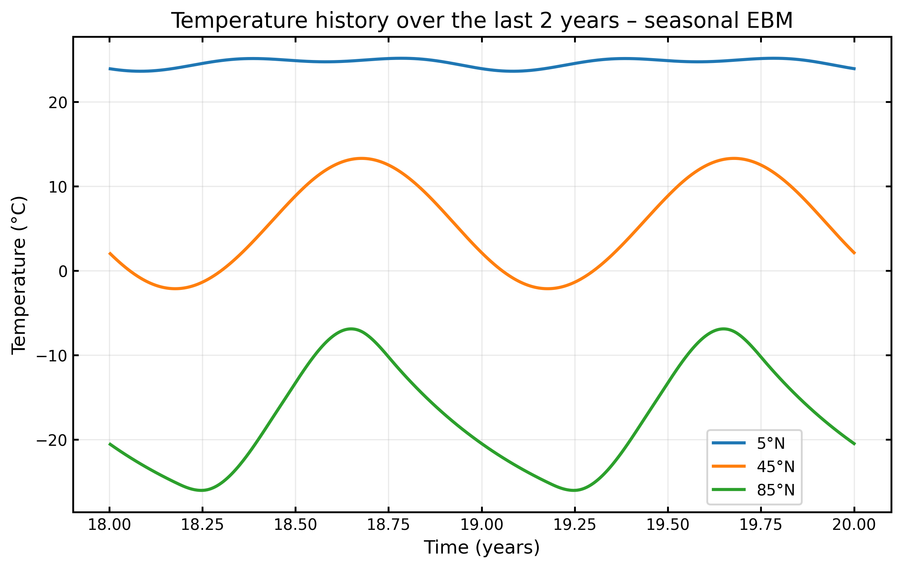
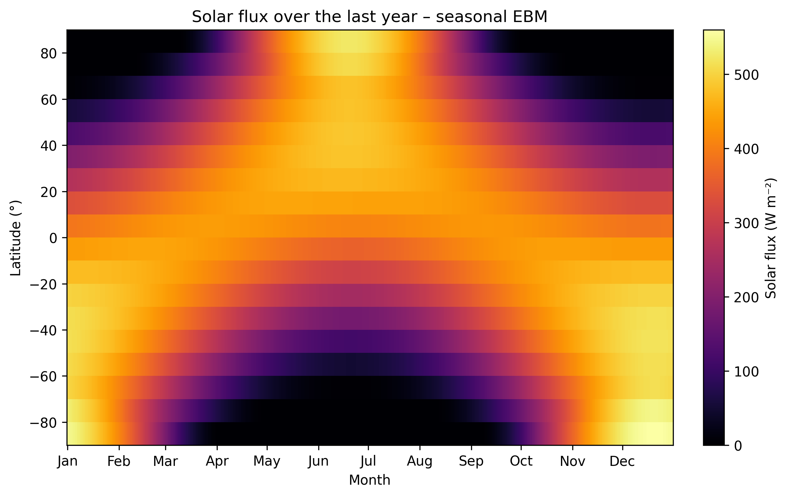
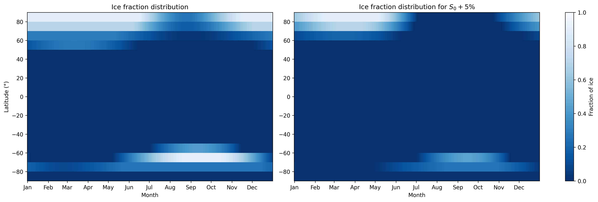
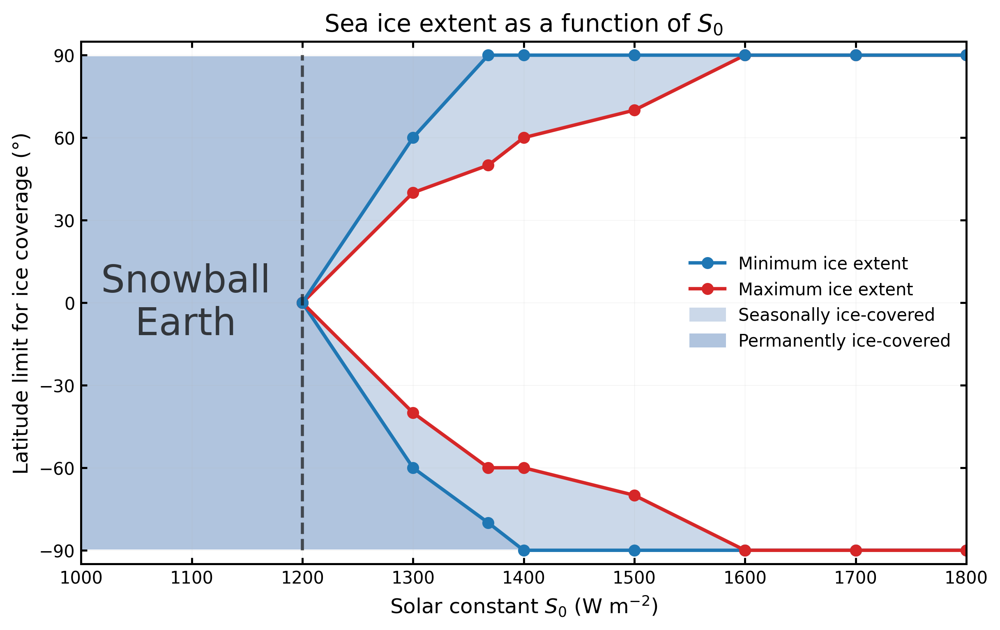

# Energy Balance Model (EBM)

## Overview
Earth’s climate results from complex interactions between the atmosphere, the oceans, the cryosphere, and the land surface. To better understand and predict how it evolves, scientists have sought to describe the climate system based on fundamental physical principles.  
It is within this framework that the first Energy Balance Models (EBMs) were developed. These simple models made it possible to relate the Earth’s average temperature to key parameters such as albedo or atmospheric composition, and they constituted an
essential step in understanding the mechanisms of the climate.

### Objective
The purpose of this project is to develop a one-dimensional energy balance model using Budyko’s formulation to describe meridional heat transport. To this end, the Earth will be divided into latitudinal bands (typically 18 bands of 10° each).   
Additionally, in order to make the model more realistic, the seasonal variation in incident solar radiation will be taken into account.  
Finally, an analysis of climate sensitivity to the solar constant will be conducted.

### Main equation
The model is one-dimensional in latitude, with heat transfer based on Budyko's formulation.  
Its main equation can be written as,

$C_i \frac{\partial T_i}{\partial t} = S_i (1 - \alpha(T_i)) - R_\uparrow(T_i) - F(T_i)$  

where $C_i$ is the heat capacity, $S_i$ is the incident solar flux, $R_\uparrow$ is the outgoing radiative flux, and $F(T_i)$ is the meridional heat transport.  

For more details on the theoretical model and its implementation, see the [project report](https://github.com/louiscleen/energy-balance-model/blob/main/energy-balance-model.pdf)

## Results

- **Temperature history** at different northern latitudes over the last two years.

<p align="center">
  
</p>


As it can be seen, the system responds with some latency (remember that the summer solstice is on June 21 in the Northern Hemisphere). This is due to the thermal capacity, which can be adjusted in the configuration file. A low value results in a more responsive system, while a higher value simulates a system that mixes a deeper layer of the ocean.  


- A very visual way to represent both the dependence on latitude and on time of the **solar flux** is a heatmap.  

<p align="center">
  
</p>

The flux is fairly constant near the equator and reaches its maximum at the poles during the summer solstice.


- Comparison of the ice fraction in a scenario where the solar constant is increased by 5%

<p align="center">
  <br>
</p>

- Investigation of the climate response for different values of the solar constant. In particular, the **latitudinal extent of the ice** as a function of $S_0$ sheds light on the **Snowball Earth** state.

<p align="center">
  <br>
</p>

For more results, see the `results/` directory

---

## Running the Project

This project uses [uv](https://github.com/astral-sh/uv), an extremely fast Python package and project manager written in Rust. 


### Prerequisites

Make sure you have `uv` installed. If not, you can install it with:

```bash
pip install uv
```

or follow the official installation instructions [here](https://docs.astral.sh/uv/getting-started/installation/).

### Setup

Clone the repository and navigate into the project directory:

```bash
git clone https://github.com/louiscleen/energy-balance-model.git
cd energy-balance-model
```

Create and sync the virtual environment:

```bash
uv sync
```

This will automatically create a virtual environment and install all required dependencies.


### Running the Code

To run the model:

```bash
uv run python scripts/run_model.py
```

This demonstration script will run the EBM1DBudyko model in its seasonal configuration.
It integrates the model over a 50-year period using a pre-industrial initial condition
and saves the temperature history and graphs to the results/run_model folder.


#### Optional: Activate the Environment

If you prefer to activate the virtual environment manually:

```bash
source .venv/bin/activate  # On macOS/Linux
.venv\Scripts\activate     # On Windows
```

Then you can run:

```bash
python scripts/run_model.py
```

### Running the Jupyter Notebooks

This project also includes Jupyter notebooks (`.ipynb`) for exploration and generating results.  
In particular, the `exploration.ipynb` notebook provides an overview of the model's features and offers a step-by-step **walkthrough** of how to use it.  

The notebooks can be opened with any compatible environment, such as JupyterLab, Jupyter Notebook, VS Code, or Google Colab.  
If you want to use Jupyter locally without adding it to the project dependencies, run:

```bash
uv run --with jupyter jupyter notebook
```
Or, if you prefer JupyterLab:

```bash
uv run --with jupyterlab jupyter lab
```

Then open the desired `.ipynb` file from the interface.


---

## Project Structure
- `configs/` - model parameters
- `data/` - input dataset
- `scripts/` - runnable scripts
- `notebooks/` - exploratory notebooks
- `results/` - generated outputs
- `src/` - model implementation 

### Notes

* Dependencies are managed via `pyproject.toml` and `uv.lock`
* No need to manually create or manage virtual environments
* `uv` ensures fast installs and reproducible environments

## Contact
Author: Louis Cleen 